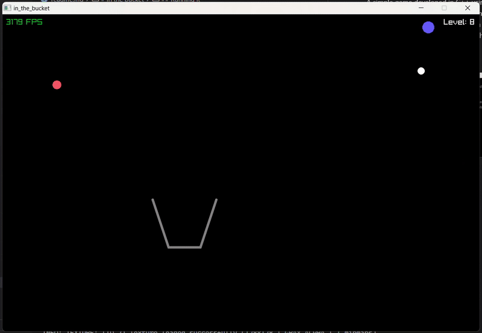
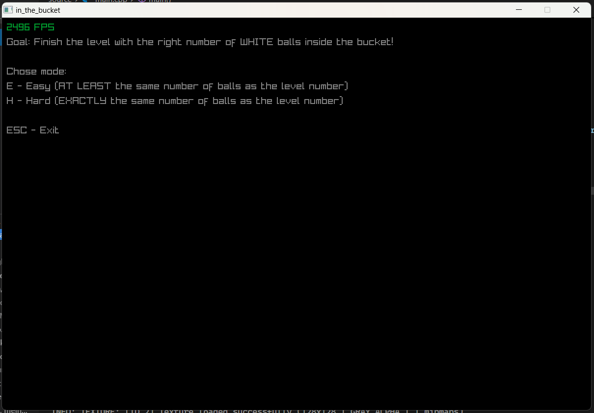

# In the bucket

A simple game developed in C++ using [raylib](https://www.raylib.com/). Created to improve my understanding of the language and explore physics-based mechanics in game development. I'm sure that this code itself could be better, but it could also be unfinished, so I'm fine with that!

### Gameplay

### Main menu

## Running it
Simply download and run the `game.exe` file under releases, or follow the steps on [this raylib template repo](https://github.com/PedroDalMoro/raylib_cpp_makefile_template) to build it locally.